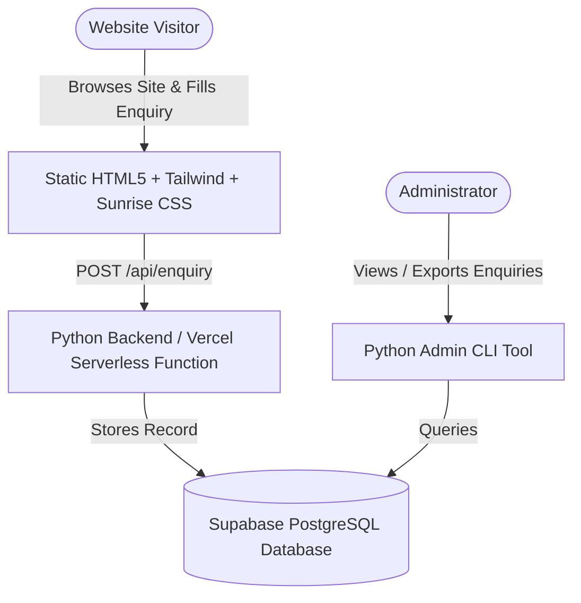

# Implementation Plan: Shree Sudhakar Group Website with Python & Supabase Integration

Create a responsive, modern corporate website for **Shree Sudhakar Group** based on `read.md` and `business_details.md`, featuring a sunrise aesthetic, interactive enquiry form, Python backend compatible with Vercel serverless deployment, and Supabase database integration.

---

## User Review Required

> [!IMPORTANT]
> - **Python Runtime**: Since Node.js/npm is not installed on your system, the project is structured with modern HTML5/Tailwind/CSS on the frontend and Python (FastAPI / Serverless) on the backend. This allows 100% local development and testing with `python app.py`, and seamless deployment on Vercel.
> - **Supabase Integration**: An enquiry table SQL script (`supabase_setup.sql`) and Python helper tools (`test_supabase.py`, `admin_tool.py`) are provided. The website can submit inquiries through the Python API (`/api/enquiry`) and optionally directly via Supabase JS client.
> - **Sunrise Theme**: The visual identity utilizes a warm sunrise palette (golden dawn amber, radiant sunburst gradients, morning sky tones, and contrasting navy/slate) along with an optional generated sunrise hero background image.

---

## Proposed Changes & Architecture

### 1. Frontend Structure (`public/` / Root)
#### [NEW] `index.html`
- **Hero Section**: Sunrise aesthetic, branding ("Shree Sudhakar Group - Building Infrastructure. Powering Progress."), quick call-to-action buttons ("Submit Enquiry", "Explore Verticals", "Call Now").
- **About Us**: Group profile, core pillars (Quality, Safety, Timely Execution, Engineering Excellence, Customer Satisfaction), strengths.
- **7 Business Verticals**:
  1. Government Infrastructure & Development
  2. Gas Pipeline Infrastructure (MDPE/PE/Steel)
  3. Electrical Infrastructure & Installations
  4. Road & Civil Construction
  5. CNG & Petrol Pump Projects (Civil & Mechanical)
  6. Residential & Commercial Construction
  7. Fabrication & PEB Structures
- **Project Showcase**: Cards with Sector, Location, Scope, Status.
- **Capabilities Matrix & Industries Served**: Interactive breakdown.
- **Interactive Enquiry Form**:
  - Modal popup & embedded section.
  - Fields: Full Name, Mobile Number, Email, Project Vertical/Service, City/Location, Project Details/Message.
  - Client-side validation, instant feedback, loading state, success message.
- **Contact & Footer Details**: Office address (Mangalam Life Park, Moshi - Alandi Road, Pimpri-Chinchwad, Maharashtra 412105), mobile (+91 9689820892), WhatsApp direct link, Google Maps link.

#### [NEW] `static/css/sunrise.css`
- Sunrise dawn gradient styling, glowing sun effect, modern card glassmorphism, responsive navigation bar, animated sunrise accents.

#### [NEW] `static/js/app.js`
- Mobile menu toggle, smooth scrolling, modal management, AJAX enquiry submission to `/api/enquiry` with fallback graceful handling.

---

### 2. Python Backend & Vercel Serverless (`api/` and `app.py`)
#### [NEW] `app.py`
- Local development server using FastAPI and Uvicorn.
- Serves static assets and provides `/api/enquiry` and `/api/health` endpoints.
- Auto-loads `.env` configuration.

#### [NEW] `api/index.py`
- Vercel Serverless Python entrypoint handling `/api/enquiry` and `/api/health`.
- Reads `SUPABASE_URL` and `SUPABASE_KEY` from environment variables.
- Validates payload with Pydantic and pushes to Supabase REST API securely without exposing service keys to client.

#### [NEW] `requirements.txt`
- Dependencies for local run and Vercel: `fastapi`, `uvicorn`, `pydantic`, `httpx`, `requests`, `python-dotenv`.

#### [NEW] `vercel.json`
- Configuration for Vercel deployment specifying Python serverless functions for `/api/(.*)` and static file routing for HTML/CSS/JS.

---

### 3. Supabase Integration & Tooling
#### [NEW] `supabase_setup.sql`
- SQL script to create `enquiries` table in Supabase SQL Editor:
  - Columns: `id`, `name`, `mobile`, `email`, `vertical`, `city`, `message`, `status`, `created_at`.
  - Row Level Security (RLS) policies and index on `created_at`.

#### [NEW] `tools/test_supabase.py`
- Python utility to verify Supabase connection, insert test enquiry, and confirm table readiness.

#### [NEW] `tools/admin_tool.py`
- Python CLI tool allowing the business owner to list enquiries, view details, update status (new/contacted/closed), or export leads to CSV.

#### [NEW] `.env.example`
- Configuration template for `SUPABASE_URL` and `SUPABASE_KEY`.

#### [NEW] `README.md`
- Clear setup guide for local preview (`python app.py`), Supabase setup in 3 minutes, and 1-click Vercel deployment.

---

## Verification Plan

### Automated / Script Verification
- Run `python -m py_compile app.py api/index.py tools/*.py` to ensure syntax validity.
- Start `app.py` locally and test `GET /` and `POST /api/enquiry` using `httpx`/`requests` to verify 200 OK and JSON validation.

### Manual Verification
- Open website in browser (via local server http://localhost:8000).
- Test mobile responsive navigation and sunrise visual aesthetics.
- Submit a sample inquiry through the form and verify validation, UI success alert, and database/mock capture.
